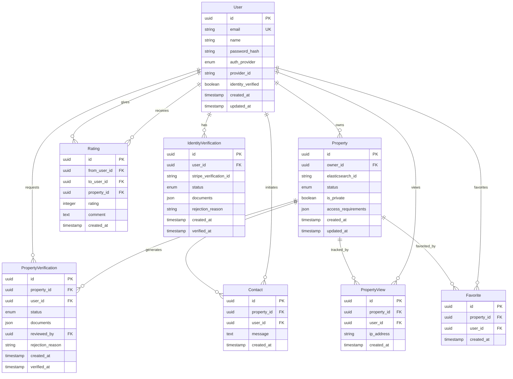

# Model de Dades - Real Estate Platform

> **Última actualització**: 2026-01-27
> 
> **Stack**: PostgreSQL + Elasticsearch + MinIO

---

## 🗄️ Arquitectura de Dades

### Distribució de Responsabilitats

| Sistema | Responsabilitat | Raó |
|---------|----------------|-----|
| **PostgreSQL** | Dades estructurades i transaccionals | ACID, relacions, integritat referencial |
| **Elasticsearch** | Dades d'immobles i cerca | Cerca full-text, filtres, agregacions, RAG |
| **MinIO** | Imatges i fitxers | Storage S3-compatible, escalable |

---

## 📊 PostgreSQL - Dades Estructurades

### Diagrama ER



---

### Taula: `users`

Gestió d'usuaris i autenticació.

```sql
CREATE TABLE users (
  id UUID PRIMARY KEY DEFAULT gen_random_uuid(),
  email VARCHAR(255) UNIQUE NOT NULL,
  name VARCHAR(255),
  password_hash VARCHAR(255), -- NULL si OAuth
  auth_provider VARCHAR(50) NOT NULL, -- 'email', 'google', 'facebook'
  provider_id VARCHAR(255), -- ID del proveïdor OAuth
  identity_verified BOOLEAN DEFAULT FALSE,
  created_at TIMESTAMP DEFAULT NOW(),
  updated_at TIMESTAMP DEFAULT NOW(),
  
  CONSTRAINT unique_provider_id UNIQUE (auth_provider, provider_id)
);

CREATE INDEX idx_users_email ON users(email);
CREATE INDEX idx_users_provider ON users(auth_provider, provider_id);
```

**Camps clau**:
- `auth_provider`: Tipus d'autenticació (`email`, `google`, `facebook`)
- `provider_id`: ID únic del proveïdor OAuth
- `identity_verified`: Indica si l'usuari ha verificat la seva identitat amb DNI

---

### Taula: `properties`

Metadades d'immobles (dades completes a Elasticsearch).

```sql
CREATE TABLE properties (
  id UUID PRIMARY KEY DEFAULT gen_random_uuid(),
  owner_id UUID NOT NULL REFERENCES users(id) ON DELETE CASCADE,
  elasticsearch_id VARCHAR(255) UNIQUE NOT NULL, -- ID del document a Elasticsearch
  status VARCHAR(50) DEFAULT 'active', -- 'active', 'paused', 'closed'
  is_private BOOLEAN DEFAULT FALSE,
  access_requirements JSONB, -- Requisits per accedir a fotos/contacte
  created_at TIMESTAMP DEFAULT NOW(),
  updated_at TIMESTAMP DEFAULT NOW(),
  
  CONSTRAINT fk_owner FOREIGN KEY (owner_id) REFERENCES users(id)
);

CREATE INDEX idx_properties_owner ON properties(owner_id);
CREATE INDEX idx_properties_status ON properties(status);
CREATE INDEX idx_properties_elasticsearch ON properties(elasticsearch_id);
```

**Camps clau**:
- `elasticsearch_id`: Referència al document complet a Elasticsearch
- `status`: Estat de l'anunci (`active`, `paused`, `closed`)
- `is_private`: Indica si l'immoble té requisits d'accés
- `access_requirements`: JSON amb requisits (ex: `{"identity_verified": true}`)

---

### Taula: `ratings`

Sistema de valoracions entre usuaris.

```sql
CREATE TABLE ratings (
  id UUID PRIMARY KEY DEFAULT gen_random_uuid(),
  from_user_id UUID NOT NULL REFERENCES users(id) ON DELETE CASCADE,
  to_user_id UUID NOT NULL REFERENCES users(id) ON DELETE CASCADE,
  property_id UUID REFERENCES properties(id) ON DELETE SET NULL, -- Context de la valoració
  rating INTEGER NOT NULL CHECK (rating >= 1 AND rating <= 5),
  comment TEXT,
  created_at TIMESTAMP DEFAULT NOW(),
  
  CONSTRAINT unique_rating UNIQUE (from_user_id, to_user_id, property_id),
  CONSTRAINT no_self_rating CHECK (from_user_id != to_user_id)
);

CREATE INDEX idx_ratings_to_user ON ratings(to_user_id);
CREATE INDEX idx_ratings_property ON ratings(property_id);
```

**Camps clau**:
- `rating`: Puntuació 1-5
- `property_id`: Immoble relacionat amb la interacció (opcional)
- Constraint `unique_rating`: Un usuari només pot valorar un altre cop per immoble

---

### Taula: `identity_verifications`

Verificacions d'identitat via Stripe.

```sql
CREATE TABLE identity_verifications (
  id UUID PRIMARY KEY DEFAULT gen_random_uuid(),
  user_id UUID NOT NULL REFERENCES users(id) ON DELETE CASCADE,
  stripe_verification_id VARCHAR(255) UNIQUE,
  status VARCHAR(50) DEFAULT 'pending', -- 'pending', 'verified', 'rejected'
  documents JSONB, -- Metadades dels documents pujats
  rejection_reason TEXT,
  created_at TIMESTAMP DEFAULT NOW(),
  verified_at TIMESTAMP,
  
  CONSTRAINT fk_user FOREIGN KEY (user_id) REFERENCES users(id)
);

CREATE INDEX idx_identity_verifications_user ON identity_verifications(user_id);
CREATE INDEX idx_identity_verifications_status ON identity_verifications(status);
```

**Camps clau**:
- `stripe_verification_id`: ID de la verificació a Stripe Identity
- `status`: Estat de la verificació
- `documents`: JSON amb metadades dels documents (noms, URLs temporals)

---

### Taula: `property_verifications`

Verificacions de propietat (DNI + IBI).

```sql
CREATE TABLE property_verifications (
  id UUID PRIMARY KEY DEFAULT gen_random_uuid(),
  property_id UUID NOT NULL REFERENCES properties(id) ON DELETE CASCADE,
  user_id UUID NOT NULL REFERENCES users(id) ON DELETE CASCADE,
  status VARCHAR(50) DEFAULT 'pending', -- 'pending', 'verified', 'rejected'
  documents JSONB NOT NULL, -- URLs dels documents a MinIO
  reviewed_by UUID REFERENCES users(id), -- Admin que va revisar
  rejection_reason TEXT,
  created_at TIMESTAMP DEFAULT NOW(),
  verified_at TIMESTAMP,
  
  CONSTRAINT fk_property FOREIGN KEY (property_id) REFERENCES properties(id),
  CONSTRAINT fk_user FOREIGN KEY (user_id) REFERENCES users(id)
);

CREATE INDEX idx_property_verifications_property ON property_verifications(property_id);
CREATE INDEX idx_property_verifications_status ON property_verifications(status);
```

**Camps clau**:
- `documents`: JSON amb URLs dels documents a MinIO (DNI, IBI)
- `reviewed_by`: Admin que va aprovar/rebutjar

---

### Taula: `contacts`

Registre de contactes entre usuaris.

```sql
CREATE TABLE contacts (
  id UUID PRIMARY KEY DEFAULT gen_random_uuid(),
  property_id UUID NOT NULL REFERENCES properties(id) ON DELETE CASCADE,
  user_id UUID NOT NULL REFERENCES users(id) ON DELETE CASCADE,
  message TEXT,
  created_at TIMESTAMP DEFAULT NOW(),
  
  CONSTRAINT fk_property FOREIGN KEY (property_id) REFERENCES properties(id),
  CONSTRAINT fk_user FOREIGN KEY (user_id) REFERENCES users(id)
);

CREATE INDEX idx_contacts_property ON contacts(property_id);
CREATE INDEX idx_contacts_user ON contacts(user_id);
CREATE INDEX idx_contacts_created_at ON contacts(created_at DESC);
```

**Ús**: Tracking de contactes per mètriques i valoracions.

---

### Taula: `property_views`

Tracking de visualitzacions d'immobles.

```sql
CREATE TABLE property_views (
  id UUID PRIMARY KEY DEFAULT gen_random_uuid(),
  property_id UUID NOT NULL REFERENCES properties(id) ON DELETE CASCADE,
  user_id UUID REFERENCES users(id) ON DELETE SET NULL, -- NULL si no autenticat
  ip_address VARCHAR(45), -- IPv4 o IPv6
  created_at TIMESTAMP DEFAULT NOW(),
  
  CONSTRAINT fk_property FOREIGN KEY (property_id) REFERENCES properties(id)
);

CREATE INDEX idx_property_views_property ON property_views(property_id);
CREATE INDEX idx_property_views_created_at ON property_views(created_at DESC);
```

**Ús**: Mètriques de visites per immoble.

---

### Taula: `favorites`

Immobles marcats com a favorits.

```sql
CREATE TABLE favorites (
  id UUID PRIMARY KEY DEFAULT gen_random_uuid(),
  property_id UUID NOT NULL REFERENCES properties(id) ON DELETE CASCADE,
  user_id UUID NOT NULL REFERENCES users(id) ON DELETE CASCADE,
  created_at TIMESTAMP DEFAULT NOW(),
  
  CONSTRAINT unique_favorite UNIQUE (property_id, user_id),
  CONSTRAINT fk_property FOREIGN KEY (property_id) REFERENCES properties(id),
  CONSTRAINT fk_user FOREIGN KEY (user_id) REFERENCES users(id)
);

CREATE INDEX idx_favorites_user ON favorites(user_id);
CREATE INDEX idx_favorites_property ON favorites(property_id);
```

---

## 🔍 Elasticsearch - Dades d'Immobles

### Índex: `properties`

Conté **tota la informació** dels immobles per cerca i filtres.

```json
{
  "mappings": {
    "properties": {
      "id": { "type": "keyword" },
      "owner_id": { "type": "keyword" },
      
      "basic_info": {
        "properties": {
          "type": { "type": "keyword" },
          "title": { "type": "text", "analyzer": "standard" },
          "description": { "type": "text", "analyzer": "standard" },
          "price": { "type": "float" },
          "rooms": { "type": "integer" },
          "square_meters": { "type": "float" }
        }
      },
      
      "location": {
        "properties": {
          "coordinates": { "type": "geo_point" },
          "autonomous_community": { "type": "keyword" },
          "province": { "type": "keyword" },
          "municipality": { "type": "keyword" },
          "address": { "type": "text" }
        }
      },
      
      "characteristics": {
        "properties": {
          "floors": { "type": "integer" },
          "orientation": { "type": "keyword" },
          "condition": { "type": "keyword" },
          "age_range": { "type": "keyword" },
          "has_elevator": { "type": "boolean" },
          "is_furnished": { "type": "boolean" }
        }
      },
      
      "energy": {
        "properties": {
          "energy_label": { "type": "keyword" },
          "co2_emissions": { "type": "float" }
        }
      },
      
      "tags": { "type": "keyword" },
      
      "images": {
        "type": "nested",
        "properties": {
          "url": { "type": "keyword" },
          "order": { "type": "integer" },
          "is_main": { "type": "boolean" }
        }
      },
      
      "contact": {
        "properties": {
          "phone": { "type": "keyword" },
          "email": { "type": "keyword" }
        }
      },
      
      "verifications": {
        "properties": {
          "property_verified": { "type": "boolean" },
          "owner_identity_verified": { "type": "boolean" },
          "has_professional_photos": { "type": "boolean" }
        }
      },
      
      "metadata": {
        "properties": {
          "created_at": { "type": "date" },
          "updated_at": { "type": "date" },
          "views_count": { "type": "integer" },
          "favorites_count": { "type": "integer" }
        }
      },
      
      "embedding": {
        "type": "dense_vector",
        "dims": 768,
        "index": true,
        "similarity": "cosine"
      }
    }
  }
}
```

**Camps clau**:
- `embedding`: Vector per cerca semàntica (RAG)
- `location.coordinates`: Geo-point per cerca per proximitat
- `tags`: Array de característiques (terrassa, A/C, etc.)
- `images`: Nested per gestionar múltiples imatges

---

### Exemples de Cerca

#### Cerca per Text
```json
{
  "query": {
    "multi_match": {
      "query": "pis terrassa Barcelona",
      "fields": ["basic_info.title^2", "basic_info.description", "location.municipality"]
    }
  }
}
```

#### Cerca per Filtres
```json
{
  "query": {
    "bool": {
      "filter": [
        { "range": { "basic_info.price": { "gte": 100000, "lte": 300000 } } },
        { "term": { "basic_info.rooms": 3 } },
        { "term": { "location.municipality": "Barcelona" } },
        { "terms": { "tags": ["terrassa", "aire_condicionat"] } }
      ]
    }
  }
}
```

#### Cerca Geogràfica
```json
{
  "query": {
    "bool": {
      "filter": {
        "geo_distance": {
          "distance": "5km",
          "location.coordinates": {
            "lat": 41.3851,
            "lon": 2.1734
          }
        }
      }
    }
  }
}
```

#### Cerca Semàntica (RAG)
```json
{
  "query": {
    "script_score": {
      "query": { "match_all": {} },
      "script": {
        "source": "cosineSimilarity(params.query_vector, 'embedding') + 1.0",
        "params": {
          "query_vector": [0.1, 0.2, ...]
        }
      }
    }
  }
}
```

---

## 📦 MinIO - Storage d'Imatges

### Estructura de Buckets

```
realstate-properties/
├── {property_id}/
│   ├── original/
│   │   ├── {image_id}.jpg
│   │   └── ...
│   ├── thumbnails/
│   │   ├── {image_id}_thumb.jpg
│   │   └── ...
│   └── optimized/
│       ├── {image_id}_1920x1080.jpg
│       └── ...
├── ...

realstate-verifications/
├── identity/
│   └── {user_id}/
│       ├── {verification_id}_dni_front.jpg
│       └── {verification_id}_dni_back.jpg
├── property/
│   └── {property_id}/
│       ├── {verification_id}_dni.pdf
│       └── {verification_id}_ibi.pdf
```

**Política de Retenció**:
- Imatges d'immobles: Permanents (mentre l'anunci existeixi)
- Documents de verificació: 7 anys (compliment legal)

---

## 🔄 Sincronització PostgreSQL ↔ Elasticsearch

### Estratègia de Sincronització

1. **Creació d'Immoble**:
   - Crear document a Elasticsearch
   - Guardar `elasticsearch_id` a PostgreSQL

2. **Actualització d'Immoble**:
   - Actualitzar document a Elasticsearch
   - Actualitzar `updated_at` a PostgreSQL

3. **Eliminació d'Immoble**:
   - Eliminar document d'Elasticsearch
   - Eliminar registre de PostgreSQL (CASCADE)

### Exemple de Flux

```typescript
async function createProperty(data: PropertyData) {
  // 1. Crear document a Elasticsearch
  const esResponse = await esClient.index({
    index: 'properties',
    document: {
      basic_info: { ... },
      location: { ... },
      // ...
    }
  });
  
  // 2. Guardar referència a PostgreSQL
  const property = await prisma.property.create({
    data: {
      owner_id: data.owner_id,
      elasticsearch_id: esResponse._id,
      is_private: data.is_private,
      // ...
    }
  });
  
  return property;
}
```

---

## 📈 Escalabilitat i Rendiment

### Índexs PostgreSQL

Tots els índexs crítics estan definits a les taules anteriors:
- FK per joins eficients
- Camps de cerca freqüent (`email`, `status`, etc.)
- Timestamps per ordenació

### Particionament (Futur)

Si el volum creix:
- **`property_views`**: Particionar per data (mensual)
- **`contacts`**: Particionar per data (mensual)

### Caché

- **Redis**: Per sessions d'usuari i dades freqüents
- **Elasticsearch**: Cache intern per queries repetides

---

## 🔐 Seguretat

### Encriptació
- **PostgreSQL**: Passwords amb bcrypt (cost 12)
- **MinIO**: Encriptació en repòs (AES-256)
- **Elasticsearch**: TLS per comunicació

### Control d'Accés
- **PostgreSQL**: Row-level security per multi-tenancy
- **MinIO**: Políticas IAM per buckets
- **Elasticsearch**: Autenticació i autorització per índex

---

**Document tècnic**: Aquest model servirà com a base per a la implementació amb Prisma, Elasticsearch client, i MinIO SDK.
