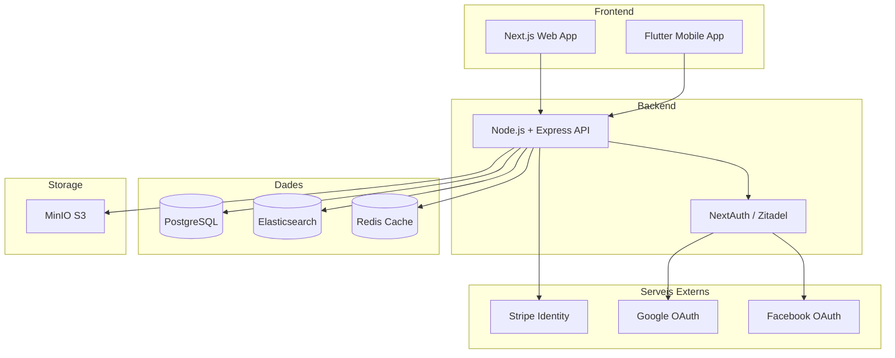
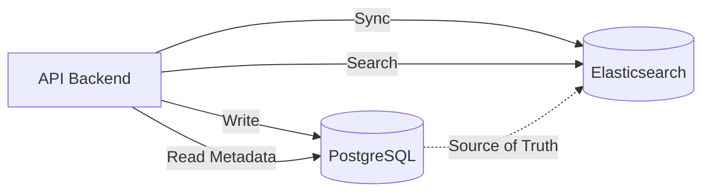
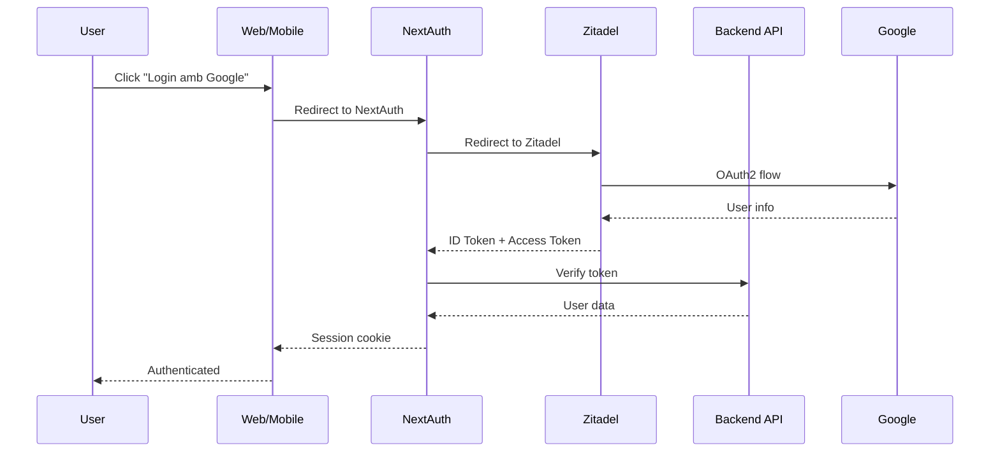
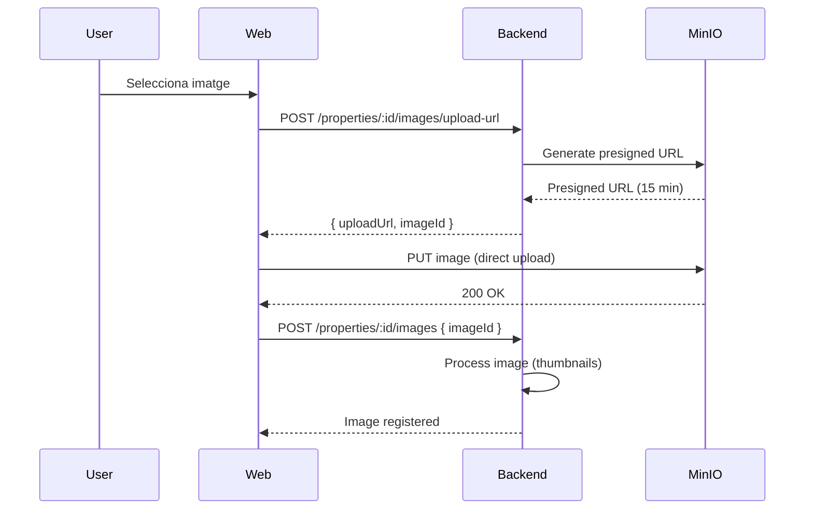

# Requisits Tècnics - Real Estate Platform

> **Última actualització**: 2026-01-27
> 
> **Estat**: Especificació tècnica completa

---

## 🏗️ Arquitectura General

### Stack Tecnològic



---

## 🔧 Tecnologies per Component

### Frontend Web

| Component | Tecnologia | Versió | Justificació |
|-----------|-----------|--------|--------------|
| Framework | Next.js | 14+ | SSR, App Router, optimització automàtica |
| Llenguatge | TypeScript | 5+ | Type safety, millor DX |
| Estils | Tailwind CSS | 3+ | Utility-first, responsive, customizable |
| Components UI | shadcn/ui | Latest | Components accessibles i customitzables |
| Formularis | React Hook Form | 7+ | Rendiment, validació |
| Validació | Zod | 3+ | Type-safe schema validation |
| Autenticació | NextAuth.js | 4+ | Integració Next.js, múltiples providers |
| State Management | Zustand | 4+ | Simple, performant, TypeScript-friendly |
| Requests | TanStack Query | 5+ | Cache, refetch, optimistic updates |
| Maps | Mapbox GL JS | 2+ | Personalitzable, rendiment |
| Imatges | next/image | Built-in | Optimització automàtica |

### Frontend Mobile

| Component | Tecnologia | Versió | Justificació |
|-----------|-----------|--------|--------------|
| Framework | Flutter | 3+ | Cross-platform, rendiment natiu |
| Llenguatge | Dart | 3+ | Type-safe, AOT compilation |
| State Management | Riverpod | 2+ | Type-safe, testable |
| Networking | Dio | 5+ | Interceptors, cache |
| Storage Local | Hive | 2+ | NoSQL local, ràpid |
| Autenticació | flutter_appauth | Latest | OIDC/OAuth2 |
| Maps | flutter_map | Latest | Mapbox/OpenStreetMap |

### Backend

| Component | Tecnologia | Versió | Justificació |
|-----------|-----------|--------|--------------|
| Runtime | Node.js | 20 LTS | Estabilitat, rendiment |
| Framework | Express | 4+ | Madur, flexible, ecosistema |
| Llenguatge | TypeScript | 5+ | Type safety |
| ORM | Prisma | 5+ | Type-safe, migracions, introspection |
| Validació | Zod | 3+ | Consistència amb frontend |
| Autenticació | Zitadel | Latest | Self-hosted, OIDC, multi-tenant |
| JWT | jsonwebtoken | 9+ | Estàndard, madur |
| File Upload | Multer | 1+ | Multipart/form-data |
| Image Processing | Sharp | 0.33+ | Rendiment, formats moderns |
| Rate Limiting | express-rate-limit | 7+ | Protecció DDoS |
| Logging | Winston | 3+ | Structured logging |
| Testing | Jest | 29+ | Ecosistema, coverage |

### Bases de Dades

| Component | Tecnologia | Versió | Justificació |
|-----------|-----------|--------|--------------|
| RDBMS | PostgreSQL | 16+ | ACID, JSON, extensions |
| Search Engine | Elasticsearch | 8+ | Full-text search, agregacions, vectors |
| Cache | Redis | 7+ | In-memory, pub/sub, sessions |
| Storage | MinIO | Latest | S3-compatible, self-hosted |

### Infraestructura

| Component | Tecnologia | Versió | Justificació |
|-----------|-----------|--------|--------------|
| Containerització | Docker | 24+ | Aïllament, reproducibilitat |
| Orquestració | Docker Compose | 2+ | Desenvolupament local |
| Reverse Proxy | Caddy | 2+ | HTTPS automàtic, simple |
| CI/CD | GitHub Actions | - | Integració GitHub, gratuït |

---

## 📦 Decisió: Elasticsearch per Immobles

### Raons per Usar Elasticsearch

#### 1. Cerca Full-Text Avançada
- **Analyzers** per català i castellà
- **Tokenització** intel·ligent
- **Stemming** i normalització
- **Sinònims** i correccions ortogràfiques

#### 2. Filtres i Agregacions
- Filtres combinats (preu + ubicació + característiques)
- Agregacions per facets (ex: "Mostra'm quants pisos hi ha a cada província")
- Rendiment constant amb milions de documents

#### 3. Cerca Geogràfica
- **Geo-point** per coordenades
- **Geo-distance** per cerca per proximitat ("Immobles a 5km de Barcelona")
- **Geo-bounding box** per àrees rectangulars

#### 4. Preparació per RAG (Retrieval-Augmented Generation)
- **Dense vectors** per embeddings
- **Cosine similarity** per cerca semàntica
- Combinació de cerca textual + semàntica (hybrid search)

#### 5. Escalabilitat
- Sharding automàtic
- Replicació per alta disponibilitat
- Rendiment lineal amb creixement de dades

### Arquitectura de Dades



**Principi**: PostgreSQL és la **source of truth**, Elasticsearch és la **search layer**.

### Sincronització PostgreSQL ↔ Elasticsearch

#### Estratègia: Dual Write

```typescript
async function createProperty(data: PropertyInput) {
  // 1. Crear a Elasticsearch (genera ID)
  const esDoc = await esClient.index({
    index: 'properties',
    document: transformToElasticsearch(data)
  });
  
  // 2. Guardar referència a PostgreSQL
  const property = await prisma.property.create({
    data: {
      ...data,
      elasticsearch_id: esDoc._id
    }
  });
  
  return property;
}
```

#### Consistència Eventual

- **Escriptures**: Dual write (PostgreSQL + Elasticsearch)
- **Lectures**: Elasticsearch per cerca, PostgreSQL per metadades
- **Reconciliació**: Job periòdic per sincronitzar discrepàncies

#### 2. Infraestructura i Desplegament
- **Contenidors**: Docker i Docker Compose per orquestrar tots els serveis.
- **Reverse Proxy**: **Caddy** com a punt d'entrada únic (`https://localhost`), gestionant SSL i l'enrutament cap al Frontend (3000) i Backend (3002).
- **Base de Dades**:
    - **PostgreSQL**: Emmagatzematge persistent principal.
    - **Gestió de Migracions**: **Prisma Migrate** (substitut de Liquibase).
    - **Seeding**: `npm run db:reset` per regenerar l'entorn de desenvolupament amb dades de prova.
- **Emmagatzematge d'Objectes**: **MinIO** (compatible S3) per a imatges i documents.
- **Cerca**: **Elasticsearch** per a cerques avançades i filtratge.
- **Cache**: **Redis** per a sessions i cache de consultes freqüents.

---

## 🔐 Autenticació i Autorització

### Arquitectura d'Autenticació



### Providers d'Autenticació

1. **Google OAuth**
   - Scope: `email`, `profile`
   - Client ID/Secret a `.env`

2. **Facebook OAuth**
   - Scope: `email`, `public_profile`
   - App ID/Secret a `.env`

3. **Credentials (Email/Password)**
   - Bcrypt per hash (cost 12)
   - Validació amb Zod

### JWT Structure

```json
{
  "sub": "user-uuid",
  "email": "user@example.com",
  "name": "User Name",
  "auth_provider": "google",
  "identity_verified": false,
  "iat": 1234567890,
  "exp": 1234571490
}
```

### Control d'Accés

#### Nivells de Permís

| Recurs | Anònim | Autenticat | Propietari | Admin |
|--------|--------|------------|-----------|-------|
| Llistar immobles | ✅ Info bàsica | ✅ Amb fotos | ✅ | ✅ |
| Detall immoble | ✅ Info bàsica | ✅ Amb fotos/contacte* | ✅ | ✅ |
| Crear immoble | ❌ | ✅ | - | ✅ |
| Editar immoble | ❌ | ❌ | ✅ | ✅ |
| Eliminar immoble | ❌ | ❌ | ✅ | ✅ |
| Contactar | ❌ | ✅ | - | ✅ |

*Segons requisits d'accés de l'immoble

#### Middleware d'Autorització

```typescript
// Exemple: Només propietari pot editar
async function requireOwnership(req, res, next) {
  const property = await prisma.property.findUnique({
    where: { id: req.params.id }
  });
  
  if (property.owner_id !== req.user.id && !req.user.is_admin) {
    return res.status(403).json({ error: 'Forbidden' });
  }
  
  next();
}
```

---

## 🖼️ Gestió d'Imatges

### Flux de Pujada



### Processament d'Imatges

Amb **Sharp**, generar:

1. **Original**: Sense modificar (màx 4K)
2. **Optimitzat**: 1920x1080, WebP, quality 85
3. **Thumbnail**: 400x300, WebP, quality 80
4. **Thumbnail petit**: 150x150, WebP, quality 75

### Estructura MinIO

```
realstate-properties/
├── {property_id}/
│   ├── original/
│   │   └── {image_id}.jpg
│   ├── optimized/
│   │   └── {image_id}_1920x1080.webp
│   ├── thumbnails/
│   │   └── {image_id}_400x300.webp
│   └── thumbnails-small/
│       └── {image_id}_150x150.webp
```

---

## 🔍 Cerca i Filtres

### Query Elasticsearch

#### Cerca Bàsica

```json
{
  "query": {
    "bool": {
      "must": [
        {
          "multi_match": {
            "query": "pis terrassa Barcelona",
            "fields": ["basic_info.title^3", "basic_info.description", "location.municipality^2"],
            "type": "best_fields",
            "fuzziness": "AUTO"
          }
        }
      ],
      "filter": [
        { "range": { "basic_info.price": { "gte": 100000, "lte": 300000 } } },
        { "term": { "basic_info.rooms": 3 } },
        { "term": { "location.province": "Barcelona" } }
      ]
    }
  },
  "sort": [
    { "_score": "desc" },
    { "metadata.created_at": "desc" }
  ]
}
```

#### Cerca Geogràfica

```json
{
  "query": {
    "bool": {
      "filter": {
        "geo_distance": {
          "distance": "10km",
          "location.coordinates": {
            "lat": 41.3851,
            "lon": 2.1734
          }
        }
      }
    }
  }
}
```

#### Agregacions (Facets)

```json
{
  "aggs": {
    "by_province": {
      "terms": { "field": "location.province", "size": 20 }
    },
    "price_ranges": {
      "range": {
        "field": "basic_info.price",
        "ranges": [
          { "to": 100000 },
          { "from": 100000, "to": 200000 },
          { "from": 200000, "to": 300000 },
          { "from": 300000 }
        ]
      }
    }
  }
}
```

---

## 🚀 Rendiment i Optimització

### Caching Strategy

| Dades | Cache | TTL | Invalidació |
|-------|-------|-----|-------------|
| Llistat immobles | Redis | 5 min | On create/update/delete |
| Detall immoble | Redis | 15 min | On update |
| Resultats cerca | Elasticsearch | Built-in | - |
| Sessions usuari | Redis | 24h | On logout |
| Imatges | CDN/Browser | 1 any | Versioning |

### Database Indexing

Tots els índexs crítics definits a `DATA_MODEL.md`:
- FK per joins
- Camps de cerca freqüent
- Timestamps per ordenació

### API Rate Limiting

```typescript
const limiter = rateLimit({
  windowMs: 15 * 60 * 1000, // 15 minuts
  max: 100, // 100 requests per IP
  standardHeaders: true,
  legacyHeaders: false,
});

app.use('/api/', limiter);
```

### Lazy Loading

- **Imatges**: Lazy load amb `loading="lazy"`
- **Llistats**: Paginació infinita (20 items per pàgina)
- **Mapes**: Carregar només quan visible

---

## 🧪 Testing

### Piràmide de Testing

```
        /\
       /  \  E2E (10%)
      /____\
     /      \  Integration (30%)
    /________\
   /          \  Unit (60%)
  /__________  \
```

### Cobertura Mínima

| Component | Cobertura Objectiu |
|-----------|-------------------|
| Backend API | 80% |
| Frontend Components | 70% |
| Utils/Helpers | 90% |

### Tests Crítics

#### Backend
- [ ] Autenticació (login, register, JWT)
- [ ] CRUD immobles
- [ ] Permisos (propietari, admin)
- [ ] Cerca Elasticsearch
- [ ] Pujada d'imatges

#### Frontend
- [ ] Formularis (validació, submit)
- [ ] Cerca i filtres
- [ ] Autenticació (login, logout)
- [ ] Gestió d'immobles

#### E2E
- [ ] Flux complet: Registre → Crear immoble → Publicar
- [ ] Flux complet: Cerca → Detall → Contacte

---

## 🔒 Seguretat

### Checklist de Seguretat

- [ ] **HTTPS** obligatori (Caddy amb Let's Encrypt)
- [ ] **CORS** configurat correctament
- [ ] **CSRF** protection (NextAuth)
- [ ] **XSS** protection (sanitització inputs)
- [ ] **SQL Injection** protection (Prisma parameterized queries)
- [ ] **Rate limiting** per endpoints
- [ ] **Helmet** per headers de seguretat
- [ ] **Secrets** a variables d'entorn (mai al codi)
- [ ] **JWT** amb expiració curta (15 min access, 7 dies refresh)
- [ ] **Passwords** amb bcrypt (cost 12)
- [ ] **File upload** validació (tipus, mida)
- [ ] **Input validation** amb Zod

---

## 📊 Monitorització i Logging

### Logging

```typescript
// Winston configuration
const logger = winston.createLogger({
  level: 'info',
  format: winston.format.json(),
  transports: [
    new winston.transports.File({ filename: 'error.log', level: 'error' }),
    new winston.transports.File({ filename: 'combined.log' }),
  ],
});
```

### Mètriques

- **APM**: Considerar New Relic o Datadog (futur)
- **Errors**: Sentry per tracking d'errors
- **Analytics**: Google Analytics o Plausible

---

## 🌍 Internacionalització

### Idiomes Suportats (MVP)

- **Català** (principal)
- **Castellà** (secundari)

### Implementació

- **Frontend**: `next-intl` o `react-i18next`
- **Backend**: Missatges d'error en múltiples idiomes
- **Elasticsearch**: Analyzers per català i castellà

---

## 📝 Documentació Tècnica

### API Documentation

- **Swagger/OpenAPI** 3.0
- Endpoint: `/api/docs`
- Generació automàtica amb `swagger-jsdoc`

### Code Documentation

- **JSDoc** per funcions complexes
- **README.md** per cada mòdul
- **Architecture Decision Records** (ADR) per decisions importants

---

## 🚢 Desplegament

### Entorns

| Entorn | URL | Propòsit |
|--------|-----|----------|
| Local | localhost | Desenvolupament |
| Staging | staging.example.com | Testing pre-producció |
| Production | example.com | Producció |

### CI/CD Pipeline

```yaml
# .github/workflows/ci.yml
name: CI/CD

on: [push, pull_request]

jobs:
  test:
    runs-on: ubuntu-latest
    steps:
      - uses: actions/checkout@v3
      - name: Run tests
        run: npm test
      
  deploy:
    needs: test
    if: github.ref == 'refs/heads/main'
    runs-on: ubuntu-latest
    steps:
      - name: Deploy to production
        run: ./deploy.sh
```

---

## 📋 Checklist Pre-Producció

- [ ] Tots els tests passen
- [ ] Cobertura de tests >80%
- [ ] Documentació API completa
- [ ] Variables d'entorn configurades
- [ ] HTTPS configurat
- [ ] Backups automàtics configurats
- [ ] Monitorització activa
- [ ] Rate limiting configurat
- [ ] Logs centralitzats
- [ ] Política de privacitat i termes d'ús

---

**Document tècnic**: Aquest document servirà com a referència per a totes les decisions tècniques del projecte.
